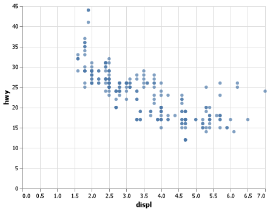

##Project 0
Gavin Forstrom

##Elevator Pitch
For this introductory project, I set up my Python workspace, imported the pandas and altair packages, read in the mpg data, and created a plot that shows the relationship between a cars mpg and displ.


## Question 1

The chart indicates that the better mileage a car gets, the lower its displ is. 

## Question 3

| manufacturer   | model   |   year |   hwy |
|:---------------|:--------|-------:|------:|
| audi           | a4      |   1999 |    29 |
| audi           | a4      |   1999 |    29 |
| audi           | a4      |   2008 |    31 |
| audi           | a4      |   2008 |    30 |
| audi           | a4      |   1999 |    26 |


##Appendix
```
import pandas as pd   
import altair as alt   

url = "https://github.com/byuidatascience/data4python4ds/raw/master/data-raw/mpg/mpg.csv"
mpg = pd.read_csv(url)

chart = (alt.Chart(mpg)
  .encode(
    x='displ', 
    y='hwy')
  .mark_circle()
)
````

