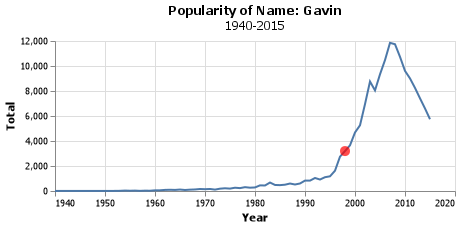
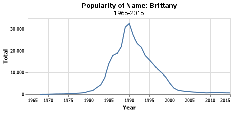
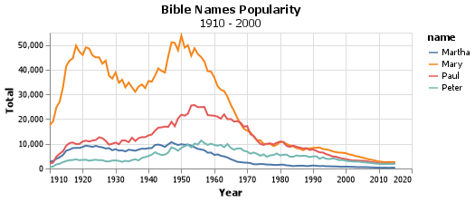
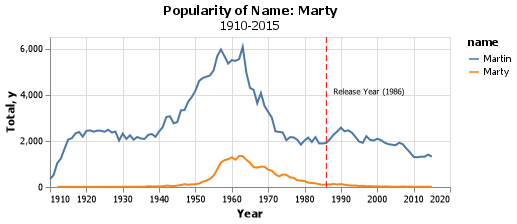

#Project 1

###Introduction
Project one focused on names from the U.S. Census. I looked at the popularity over time for a few different names and discovered a few trends that may be meaningful.

###Grand Question One
How does your name at your birth year compare to its use historically?



###Grand Question Two
If you talked to someone named Brittany on the phone, what is your guess of his or her age? What ages would you not guess?

My guess would be that Brittany would most likely be in their early to mid 30's. I would not guess that Brittany is over 50 years old or under 20.



The graph shows the rise and fall of the name Brittany with its apex in 1990. This information is in line with my guess that a "Brittany" would be in her early to mid thirties as 1990 was 31 years ago.

###Grand Question Three
Mary, Martha, Peter, and Paul are all Christian names. From 1920 to 2000, compare the name usage of each of the four names.



The plot of the four bible names shows some interesting trends. Of course, Mary has been the most popular, peaking at a count of nearly 55,000 in the year 1950. What I am curious about is the big dip in the 30's. My first thought is this could be due to the Great Depression and many people turning from religion due to the hardships of life.

As the 20th century continued, these biblical names began to see a steady decrease after about the 60's. This decrease has continued to the present day, reflecting this nations turning away from God and religion.

###Grand Question Four
Think of a unique name from a famous movie. Plot the usage of that name and see how changes line up with the movie release.

Lets look at the name Marty, the main character for Back to the Future (1985).



The name Marty rose to high popularity in the late 50's and early 60's. This increase steadily declined after that point, and saw no great buffer by the release of "Back to the Future". I suspect that in this case, the choice of character name was influenced more by the earlier popularity of the name Marty, rather than more children being named Marty following the release of the film.

##Conclusion

A name is a unique label that for many people carries great significance. Studying and analyzing the data behind a name can give insights into one's individuality. There are seemingly infinite questions you could ask and then answer based on this data and it was a delight to answer just a few.


```
import pandas as pd
import altair as alt

names = pd.read_csv("names_year.csv")

gavin = names.query('name == "Gavin"')

gavin_chart  = (alt.Chart(gavin)               #all charts need a chart, mark, and encode to get output#
    .mark_line()
    .encode(
        x = alt.X('year', axis = alt.Axis(format = 'd', title = "Year")),
        y = 'Total',
        )
    .properties(
        height = 150,
        width = 400,
        title = {'text': "Popularity of Name: Gavin", 'subtitle': "1940-2015"}
    )
)

birthday = gavin.query('year == 1998')
birthday

birthday_point = (alt.Chart(birthday)
    .mark_circle(color='red', size = 100)
    .encode(x = 'year', y = 'Total'))

gavin_chart = gavin_chart + birthday_point

gavin_chart.save("gavin_chart.png")

brittany = names.query('name == "Brittany"')

brittany_chart  = (alt.Chart(brittany)               #all charts need a chart, mark, and encode to get output#
    .mark_line()
    .encode(
        x = alt.X('year', axis = alt.Axis(format = 'd', title = "Year")),
        y = 'Total',
        )
    .properties(
        height = 150,
        width = 400,
        title = {'text': "Popularity of Name: Brittany", 'subtitle': "1965-2015"}
    )
)
brittany_chart

brittany_chart.save('brittany.png')

bible_names = ['Mary', 'Martha', 'Peter', 'Paul']

bible = names.query('name == @bible_names')

bible_chart = (alt.Chart(bible)             
    .mark_line()
    .encode(
        x = alt.X('year', axis = alt.Axis(format = 'd', title = "Year")),
        y = 'Total',
        color = 'name',
        )
    .properties(
        height = 150,
        width = 400,
        title = {'text': "Bible Names Popularity", 'subtitle': "1910 - 2000"}
    )
)

bible_chart.save('bible.png')

marty = names.query('name == "Marty"')
martin = names.query('name == "Martin"')

mcfly = ['Marty', 'Martin']

mcflydata = names.query('name == @mcfly')

release = marty.query('year == 1986')

#creating marty mcfly chart

marty_chart = (alt.Chart(mcflydata)
    .mark_line()
    .encode(
        x = alt.X('year', axis = alt.Axis(format = 'd', title = "Year")),
        y = 'Total',
        color = 'name'
        )
    .properties(
        height = 150,
        width = 400,
        title = {'text': "Popularity of Name: Marty", 'subtitle': "1910-2015"}
    )
)

release_point = (alt.Chart(release)
    .mark_rule(color='red', size = 1, strokeDash=[6,3])
    .encode(x = 'year'))

release_year= pd.DataFrame({'x':[1986], 'y':[4100], 'text':"Release Year (1986)"})

release_text = alt.Chart(release_year).mark_text(
    align='left',
    baseline='middle',
    fontSize = 8,
    dx = 7
).encode(
    x = 'x',
    y = 'y',
    text = 'text')
```