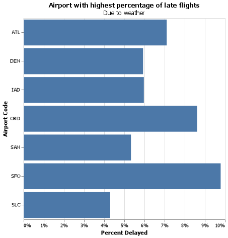

# Project 2: Airports, Delays, JSON

*Gavin Forstrom*

#### Summary

The following project takes a dive into the data of seven large airports in the United States. It investigates the airports that experience the longest average delay times, the best month to fly to avoid delays, and the impact weather has on flight delays.


#### Question 1: Which airport has the worst delays?

For this analysis, "worst" will be defined as the airport whose average flight delay time is the longest.

| airport_code   |   total_flights |   total_delays |   total_delay_min |   percent_delays |   avg_delay_hrs |
|:---------------|----------------:|---------------:|------------------:|-----------------:|----------------:|
| ATL            |         4430047 |         902443 |          53983926 |         0.20371  |        0.996996 |
| DEN            |         2513974 |         468519 |          25173381 |         0.186366 |        0.895495 |
| IAD            |          851571 |         168467 |          10283478 |         0.197831 |        1.01736  |
| ORD            |         3597588 |         830825 |          56356129 |         0.230939 |        1.13053  |
| SAN            |          917862 |         175132 |           8276248 |         0.190804 |        0.78762  |
| SFO            |         1630945 |         425604 |          26550493 |         0.260955 |        1.03972  |
| SLC            |         1403384 |         205160 |          10123371 |         0.146189 |        0.822396 |


Chicago O'Hare has the longest average delayed flight at one hour and eight minutes. San Francisco is next at one hour and two minutes.

#### Question 2: What is the best month to fly if you want to avoid delays of any length?


December is the worst month to fly with 25.6 % of flights experiencing some amount of a delay.

#### Question 3: Create a new column that calculates the total number of flights delayed by weather (both severe and mild).


The following table contains four new columns that explore the amount of flights delayed due to specific weather delays. There were n/a's in the data that needed to be replaced and this was done by performing column specific calculations to determine the appropriate value.

| airport_code   |   severe |   mild_late |   mild_nas |   total |
|:---------------|---------:|------------:|-----------:|--------:|
| ATL            |      448 |     332.731 |    2988.7  | 3769.43 |
| DEN            |      233 |     278.4   |     607.75 | 1119.15 |
| IAD            |       61 |     317.4   |     581.75 |  960.15 |
| ORD            |      306 |     676.5   |    3519.75 | 4502.25 |
| SAN            |       56 |     204     |     414.7  |  674.7  |

#### Question 4: Create a barplot showing the proportion of all flights that are delayed by weather at each airport.


San Francisco experiences the highest percentage of flights delayed due to weather coming in at just under 10%. In other words, 10% of flights are delayed due to the weather.

#### Question 5: Fix all of the varied missing data types in the data to be consistent and convert the new data back to JSON format.

In order to correct all of the missing data I used a couple functions to identify data that was incorrect. Then I created a list of each error and filled each instance of those values with a proper NaN. I then printed a JSON file with the tidy data

```
        "airport_code": "ATL",
        "airport_name": "Atlanta, GA: Hartsfield-Jackson Atlanta International",
        "month": "January",
        "year": 2005.0,
        "num_of_flights_total": 35048.0,
        "num_of_delays_carrier": null,
        "num_of_delays_late_aircraft": null,
        "num_of_delays_nas": 4598.0,
        "num_of_delays_security": 10.0,
        "num_of_delays_weather": 448.0,
        "num_of_delays_total": 8355.0,
        "minutes_delayed_carrier": 116423.0,
        "minutes_delayed_late_aircraft": 104415.0,
        "minutes_delayed_nas": 207467.0,
        "minutes_delayed_security": 297.0,
        "minutes_delayed_weather": 36931.0,
        "minutes_delayed_total": 465533.0
```

## Appendix A

```python
import pandas as pd
import numpy as np 
import altair as alt

url = 'https://github.com/byuidatascience/data4missing/raw/master/data-raw/flights_missing/flights_missing.json'

flights = pd.read_json(url)

worst = (flights
    .groupby('airport_code')
    .agg(total_flights = ('num_of_flights_total', sum),
        total_delays = ('num_of_delays_total', sum),
        total_delay_min = ('minutes_delayed_total', sum))
    .assign(percent_delays = lambda x: x.total_delays / x.total_flights)
    .assign(avg_delay_hrs = lambda x: (x.total_delay_min / x.total_delays) / 60)
    .reset_index()
    )

print(worst.to_markdown(index = False))      ##Copy and paste result into report##

delay_hrs = (alt.Chart(worst)
    .mark_bar().encode(
     x = alt.X('airport_code', axis = alt.Axis(title = "Airport")),
     y = alt.Y('avg_delay_hrs', axis=alt.Axis(title = "Average Delay")))
    .properties(
    height = 400,
    width = 400,
    title = {'text': "Longest Delay Times", 'subtitle': "By Airport"}))

#remove n/a columns
flight_month = flights.query("month != 'n/a'")

worst2 = (flight_month
    .groupby('month')
    .agg(total_flights = ('num_of_flights_total', sum),
        total_delays = ('num_of_delays_total', sum),
        total_delay_min = ('minutes_delayed_total', sum))
    .assign(percent_delays = lambda x: x.total_delays / x.total_flights)
    .assign(avg_delay_hrs = lambda x: (x.total_delay_min / x.total_delays) / 60)
    .reset_index()
    )

month_list = ['January', 'Febuary', 'March', 'April', 'May', 'June', 'July', 'August', 'September', 'October', 'November', 'December']

worstmonth = (alt.Chart(worst2).mark_bar()
    .encode(x = alt.X('month', sort = month_list, axis = alt.Axis(title = "")),
            y = alt.Y('percent_delays', axis = alt.Axis(format = '%', title = "")))
    .properties(
    height = 400,
    width = 400,
    title = {'text': "Percent of Flights Delayed", 'subtitle': "By Month"}))

#total_weather_delays = weather + 0.3 * LateAircraft + {if April-August, 0.4 * NAS else 0.65 * NAS}#

#replacing -999 with NaN
q3data = flights

q3data.num_of_delays_late_aircraft.replace(-999, np.nan, inplace = True)

#Calculate mean
q3mean = q3data.num_of_delays_late_aircraft.mean()

#Replace NaN with mean
q3data.num_of_delays_late_aircraft.replace(np.nan, q3mean, inplace = True) #or q3data.num_of_delays_late_aircraft.fillna(value = q3mean, inplace = True)

months = ["April", "May", "June", "July", "August"]

weather = q3data.assign(
    severe = q3data.num_of_delays_weather,
    mild_late = .3*q3data.num_of_delays_late_aircraft,
    mild_nas = np.where(q3data.month.isin(months), .4 *q3data.num_of_delays_nas, .65 * q3data.num_of_delays_nas),
    total = lambda x: x.severe + x.mild_late + x.mild_nas)

weatherfiltered = weather.filter(['airport_code', 'severe', 'mild_late', 'mild_nas', 'total']).head()

print(weatherfiltered.to_markdown(index = False))

#weather_proportion = weather.assign(
#       weather_late_proportion = weather.total / weather.num_of_flights_total)

percent_delayed_w = (weather.groupby("airport_code")
  .agg(total_weather =  ('total', sum),
      total_flights = ('num_of_flights_total', sum))
  .assign(percent_delay_w = lambda x: x.total_weather / x.total_flights)
  .reset_index()
)

weatherpercent = (alt.Chart(percent_delayed_w).mark_bar()
    .encode(y = alt.Y('airport_code', axis = alt.Axis(title="Airport Code")),
            x= alt.X('percent_delay_w', axis = alt.Axis(format = '%', title = "Percent Delayed")))
       .properties(
        height = 400,
        width = 400,
        title = {'text': "Airport with highest percentage of late flights", 'subtitle': "Due to weather"})
        )

#Fix missing data, then export as json
replace_list = [-999, 'n/a',"","1500+"]

q5data = flights.replace(replace_list, np.nan)

import json

json_data = q5data.to_json(orient = "records")

json_object = json.loads(json_data)
json_formatted_str = json.dumps(json_object, indent = 4)

print(json_formatted_str)
```