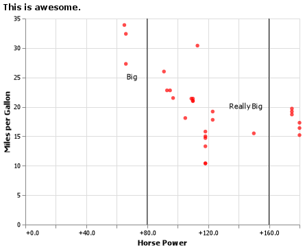
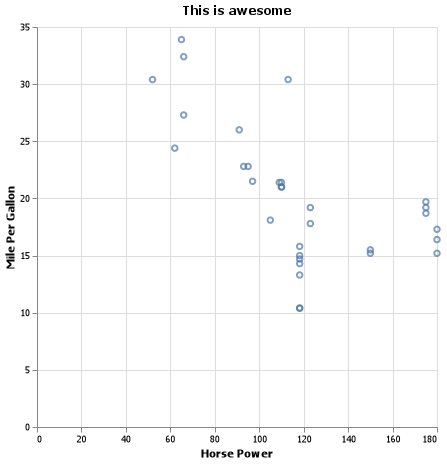

## "Coding Challenge" Example
​
### Name: _Your name here_
​
### Instructions
​
_In the Final Coding Challenge I will ask you to complete problems about as challenging as what is shown below.  Plus, you will need to fit a machine learning model with data I provide._
​
_Remember, you will only have 60 minutes to work on the challenge! You will not be able to complete every question perfectly, but you should spend at least a little time on each question._
​
_Paste your answers and code inside this `.md` file._
​
--- 
​
### Practice Challenges
​
Start by loading these packages and data:
​
```python
​
import pandas as pd
import altair as alt
import numpy as np
​
dat = pd.read_csv('https://github.com/byuidatascience/data4missing/raw/master/data-raw/mtcars_missing/mtcars_missing.csv')
​
```
​
<br>
​
**Question 1:** Try recreating the chart below using the [mtcars missing](https://github.com/byuidatascience/data4missing/raw/master/data-raw/mtcars_missing/mtcars_missing.csv) data that you've already loaded.
​
- Note that `hp` has missing values, and you will have to replace them with the mean.
- Please drop all cars with a missing name.
​

​
**Question 1 Answer:**
​

​
**Question 1 Code:**

```
q1dat = dat

q1mean = q1dat.hp.mean()

q1dat.hp.replace(np.nan, q1mean, inplace= True)

mpghp = (alt.Chart(q1dat).mark_point()
    .encode(x = alt.X('hp', axis = alt.Axis(title = 'Horse Power')),
            y = alt.Y('mpg', axis = alt.Axis(title = 'Mile Per Gallon')))
    .properties(
        height = 400,
        width = 400,
        title = {'text': "This is awesome"})
)

mpghp.save('mpghp.png')
```
​
<br>
​
**Question 2:** Try writing code to recreate the following table.
​
- Have `cyl` on the rows and `carb` on the columns
- The values inside the table represent the number of cars with that particular `cyl`/`carb` combination.
- The `pd.crosstab()` function could be helpful, or maybe `pd.pivot_table()`.
​
​
|   cyl |   1 |   2 |   3 |   4 |   6 |   8 |
|------:|----:|----:|----:|----:|----:|----:|
|     4 |   5 |   6 |   0 |   0 |   0 |   0 |
|     6 |   2 |   0 |   0 |   4 |   1 |   0 |
|     8 |   0 |   4 |   3 |   6 |   0 |   1 |
​
**Question 2 Answer:**
​
|   cyl |   1 |   2 |   3 |   4 |   6 |   8 |
|------:|----:|----:|----:|----:|----:|----:|
|     4 |   5 |   6 |   0 |   0 |   0 |   0 |
|     6 |   2 |   0 |   0 |   4 |   1 |   0 |
|     8 |   0 |   4 |   3 |   6 |   0 |   1 |
​
**Question 2 Code:**
```
print(pd.crosstab(dat.cyl, dat.carb).to_markdown())```
```
<br>
​
**Question 3:** On the Final Coding Challenge, I will also ask you to fit a Machine Learning Model.