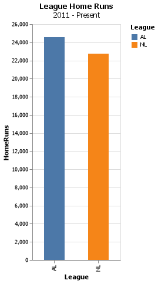

# Project 3 

__Gavin Forstrom__


## Project Summary

I grew up playing baseball since I was 4 years old. Because of this passion of mine, I have always been fascinated with the statistics behind the game. Modern baseball has seen a large shift in relying on data to predict outcomes of games. 

The following analysis dives into some of the more general stats in the great game of baseball. It utilizes SQL queries that gather data from the Lahman database. This data is compiled and then used to gain insights into baseball

## Technical Details


#### Question 1: Pro salaries for former BYU-Idaho baseball players

| playerid   | schoolid   |   salary |   yearid | teamid   |
|:-----------|:-----------|---------:|---------:|:---------|
| stephga01  | idbyuid    |   800000 |     2003 | SLN      |
| stephga01  | idbyuid    |   900000 |     2002 | SLN      |
| stephga01  | idbyuid    |   550000 |     2000 | SLN      |
| lindsma01  | idbyuid    |   410000 |     2009 | FLO      |
| lindsma01  | idbyuid    |  2300000 |     2013 | CHA      |
| stephga01  | idbyuid    |   215000 |     1999 | SLN      |
| stephga01  | idbyuid    |  1025000 |     2001 | SLN      |
| lindsma01  | idbyuid    |   380000 |     2007 | FLO      |
| stephga01  | idbyuid    |   185000 |     1998 | PHI      |
| lindsma01  | idbyuid    |  1625000 |     2010 | HOU      |
| lindsma01  | idbyuid    |  3600000 |     2012 | BAL      |
| lindsma01  | idbyuid    |  4000000 |     2014 | CHA      |
| lindsma01  | idbyuid    |  2800000 |     2011 | COL      |
| lindsma01  | idbyuid    |   395000 |     2008 | FLO      |
| stephga01  | idbyuid    |   150000 |     1997 | PHI      |

#### Question 2: Batting Average Analysis

Players with one at bat

| PlayerID   |   YearID |   BattingAvg |
|:-----------|---------:|-------------:|
| peterbi01  |     1942 |            1 |
| henrydu01  |     1921 |            1 |
| kuczest01  |     1949 |            1 |
| whiteer01  |     1947 |            1 |
| schlibi01  |     1914 |            1 |

Players with ten at bats

| PlayerID   |   YearID |   BattingAvg |
|:-----------|---------:|-------------:|
| nymanny01  |     1974 |        0.643 |
| carsoma01  |     2013 |        0.636 |
| altizda01  |     1910 |        0.6   |
| silvech01  |     1948 |        0.571 |
| puccige01  |     1930 |        0.563 |

Entire careers with at least 100 at bats

| PlayerID   |   Hits |   AtBats |   BattingAvg |
|:-----------|-------:|---------:|-------------:|
| cobbty01   |   4189 |    11436 |        0.366 |
| barnero01  |    860 |     2391 |        0.36  |
| meyerle01  |    513 |     1443 |        0.356 |
| kingst01   |     96 |      272 |        0.353 |
| delahed01  |   2597 |     7510 |        0.346 |


#### Question 3: Total League HRs in last decade

In the last decade, which League (American or National) has hit more home runs.

| League   |   HomeRuns |
|:---------|-----------:|
| NL       |      22747 |
| AL       |      24571 |

Since 2011, the American League has hit 24,571 home runs. This is 1,824 more than the national league or about 180 more homeruns per season. This result makes sense to me because the biggest difference between the two leagues is the Designated Hitter rule. In the AL, the pitchers (who are statistically weaker hitters) do not hit and are replaced with a designated hitter (Who are generally strong hitters). The NL, on the other hand, has no such rule. Therefore, 1 out of the 9 hitters in the line up is statistically less likely to hit a home run.

## Appendix A

_This is where your python script will go. Your code should be commented and well organized._

```python
import datadotworld as dw
import altair as alt
import pandas as pd

byuiplayers = dw.query('byuidss/cse-250-baseball-database', 
'''
SELECT DISTINCT c.playerid, c.schoolid, salary, s.yearid, s.teamid
FROM collegeplaying c
JOIN salaries s
ON c.playerid = s.playerid
WHERE schoolid = "idbyuid"
''')

print(byuiplayers.dataframe.to_markdown(index = False))

oneatbat = dw.query('byuidss/cse-250-baseball-database', 
'''
SELECT playerid as PlayerID, yearid as YearID, SUM(h)/SUM(ab) AS BattingAvg
FROM batting
GROUP BY playerid, yearid
HAVING ab >= 1
ORDER BY battingavg desc
LIMIT 5
''')

print(oneatbat.dataframe.to_markdown(index = False))

tenatbat = dw.query('byuidss/cse-250-baseball-database', 
'''
SELECT playerid as PlayerID, yearid as YearID, ROUND (h/ab, 3) AS BattingAvg
FROM batting
GROUP BY playerid, yearid
HAVING ab >= 10
ORDER BY battingavg desc
LIMIT 5
''')

print(tenatbat.dataframe.to_markdown(index = False))

hundredatbat = dw.query('byuidss/cse-250-baseball-database', 
'''
SELECT playerid as PlayerID, sum(H) as Hits, sum(AB) as AtBats, ROUND(sum(H)/sum(AB), 3) AS BattingAvg
FROM batting
GROUP BY playerid
HAVING ab >= 100
ORDER BY battingavg desc
LIMIT 5
''')

print(hundredatbat.dataframe.to_markdown(index = False))

SELECT  lgid as League, SUM(hr) as HomeRuns

LHRChart = (alt.Chart(LHR)
    .mark_bar(size = 35)
    .encode(
            x = 'League',
            y = 'HomeRuns',
            color = 'League')
    .properties(
        height = 400,
        width = 150,
        title = {'text': "League Home Runs", 'subtitle': "2011 - Present"}
))

LHRChart.save('LHR.png')

```