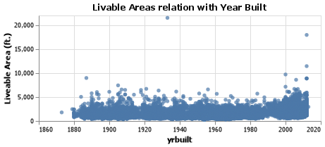
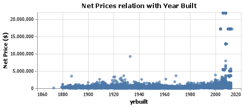
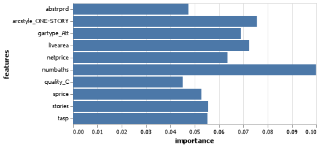
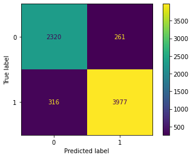

# Classifying Homes

Gavin Forstrom


## Project Summary

The following project takes a dive into simple machine learning. Given data for homes in Denver, Colorado it was my job to create an algorithm that identifies whether or not a home was built before 1980 based on a set of specific characteristics. Using different models from the sklearn package, I was able to successfully create a model that achieved 92% accuracy.

## Technical Details

#### Grand Question 1
##### Create 2-3 charts that evaluate potential relationships between the house variables and the variable before1980 Explain what you learn from the charts that could help a machine learning algorithm.

I took a look at the variables 'livearea' and 'netprice' to investigate whether or not they played a key role in identifying whether or not a home was built before 1980. Both of the charts do not provide thebest picture and leads me to conclude that they are not the best indicators of a 'yrbuilt'. One takeaway is that after 2000, more large/expensive homes were built.






#### Grand Question 2
##### Build a classification model labeling houses as being built “before 1980” or “during or after 1980”. Your goal is to reach 90% accuracy. Explain your final model choice (algorithm, tuning parameters, etc) and describe what other models you tried.

Using a Random Forest Classifier model I was able to achieve a 92% accuracy in identifying homes built before 1980. I used 10 estimators and focused on all features of the home data excluding the 'before1980', 'yrbuilt' and 'parcel' columns.  A colum was created based on the original data to identify if a home was built before 1980 according to the data given then this column was used as the target of our machine learning model. I also tried using the GaussianNB model which resulted in an accuracy score of 66% and a Decision Tree model that resulted in an accuracy score of 89%.


#### Grand Question 3
##### Justify your classification model by discussing the most important features selected by your model. This discussion should include a chart and a description of the features.



The most important features identified by the model were the number of baths, the one story architecture style and the amount of liveable area. This is interesting since the 'livearea' did not appear to have a great difference between pre and post 1980. But these features do make sense. As technology has progressed so has the construction of housing. Bathrooms are easier to install and people want more bathrooms in their homes. Furthermore, many current homes are built to be at least two stories and sometimes inluding basements. 

#### Grand Question 4
##### Describe the quality of your classification model using 2-3 different evaluation metrics. You also need to explain how to interpret each of the evaluation metrics you use.



This confusion matrix displays the results of the model analyzing the data. In this scenario, the model is determining whether or not a home was built before 1980 to suspect the presence of asbestos in the construction. If the machine identifies a home as meeting the features to be before 1980 but it is in fact not this is not a big deal. This would be a false positive. If a home built before 1980 was not recognized by the model this would be a false negative and this is more of an issue. 

2320 homes were not built before 1980 and were identified correctly and 3977 were built after and were also identified correctly.

Below are the results for the precision score and the recall score. The precision score is a helpful evaluation metric as it helps identify the percentage of false negatives that did appear in the data.


              precision    recall  f1-score   support

           0       0.88      0.90      0.89      2581
           1       0.94      0.93      0.93      4293

    accuracy                           0.92      6874


````


## Appendix A

```python
import pandas as pd
import altair as alt
import numpy as np

from sklearn.model_selection import train_test_split
from sklearn.naive_bayes import GaussianNB
from sklearn import metrics
from sklearn.tree import DecisionTreeClassifier

from sklearn.ensemble import RandomForestClassifier

alt.data_transformers.enable('json')

denver = pd.read_csv('https://github.com/byuidatascience/data4dwellings/raw/master/data-raw/dwellings_denver/dwellings_denver.csv')

dwellings_ml = pd.read_csv("https://github.com/byuidatascience/data4dwellings/raw/master/data-raw/dwellings_ml/dwellings_ml.csv")

neighborhood = pd.read_csv("https://github.com/byuidatascience/data4dwellings/raw/master/data-raw/dwellings_neighborhoods_ml/dwellings_neighborhoods_ml.csv")

#create T/F column for before 1980
denver['before1980'] = denver.yrbuilt < 1980

avgdata = denver.groupby('before1980').agg(avg_netprice = ('netprice', np.mean)).reset_index()
denver

netprice = (alt.Chart(denver)
    .mark_circle()
    .encode(
        alt.X('yrbuilt', scale = alt.Scale(zero = False),
        axis =alt.Axis(format = 'd')),
        alt.Y('netprice', axis = alt.Axis(title= 'Net Price ($)')))
        .properties(
        height = 150,
        width = 400,
        title = {'text': "Net Prices relation with Year Built"})
)

netprice.save('netprice.png')

livearea = (alt.Chart(denver)
    .mark_circle()
    .encode(
        alt.X('yrbuilt', scale = alt.Scale(zero = False),
        axis =alt.Axis(format = 'd')),
        alt.Y('livearea', axis = alt.Axis(title= 'Liveable Area (ft.)')))
        .properties(
        height = 150,
        width = 400,
        title = {'text': "Livable Areas relation with Year Built"})
)

livearea.save('livearea.png')

targets = dwellings_ml.before1980
features = dwellings_ml.drop(columns=['before1980', 'yrbuilt', 'parcel'])
#features = dwellings_ml.filter(['nocars', 'numbaths'])
#features = dwellings_ml.filter(['livearea', 'basement', 'stories', 'nocars', 'numbaths'])

features_train, features_test, targets_train, targets_test = train_test_split(
    features, 
    targets, 
    test_size = .3, 
    random_state = 24601) 

    classifierGNB = GaussianNB()

classifierGNB.fit(features_train, targets_train)

targets_predicted = classifierGNB.predict(features_test)

targets_test
targets_predicted
metrics.accuracy_score(targets_test, targets_predicted)

classifierDT = DecisionTreeClassifier(max_depth=10)

classifierDT.fit(features_train, targets_train)

targets_predicted = classifierDT.predict(features_test)

metrics.accuracy_score(targets_test, targets_predicted)

classifierRF = RandomForestClassifier(n_estimators=10)

classifierRF.fit(features_train, targets_train)

targets_predicted = classifierRF.predict(features_test)

metrics.accuracy_score(targets_test, targets_predicted)

classifierRF.feature_importances_

feature_df = pd.DataFrame({'features':features.columns, 'importance':classifierRF.feature_importances_})
top10 = feature_df[feature_df['importance'] >= 0.045].sort_values('importance', ascending=False)


### plot of features and importance

top10features = (alt.Chart(top10)
.mark_bar()
.encode(x = 'importance',
        y = 'features')
)
top10features.save('top10.png')

metrics.plot_confusion_matrix(classifierRF, features_test, targets_test)

print(metrics.classification_report(targets_test, targets_predicted))
```