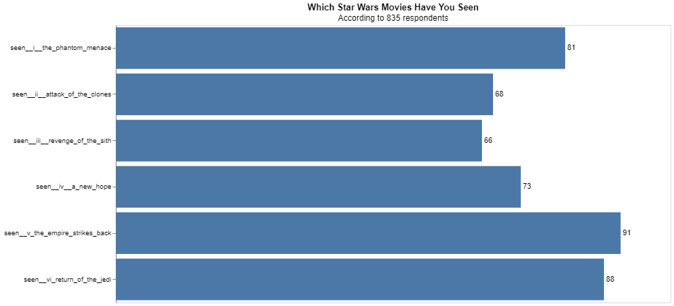
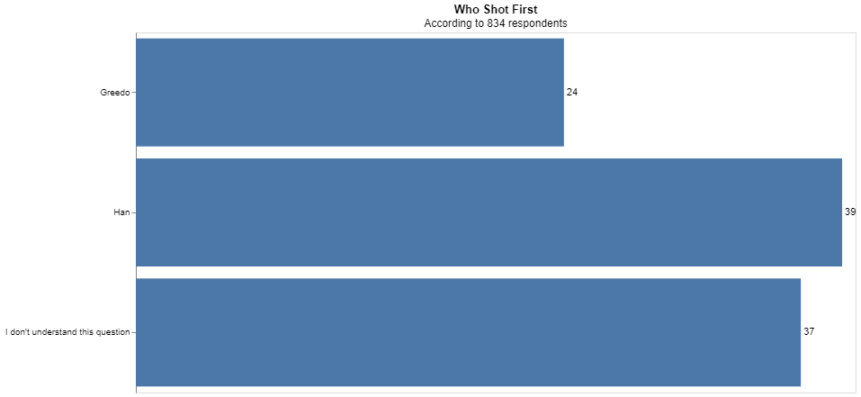

# Project 5

__Gavin Forstrom__

## Project Summary

The following report is based off a Star Wars survey that includes information about respondents favorite movies and characters, as well as additional information. By cleaning and wrangling the survey questions and responses, a machine learning model was created to predict if a respondent had a household income of over $50,000. Two statistics and two charts were created and compared to stats and charts from the original article to confirm that our data was wrangled properly.

## Technical Details

#### Grand Question 1
__Shorten the column names and clean them up for easier use with pandas.__

|:--------------------------------|
| respondentid                    |
| have_seen_any                   |
| fan_sw                          |
| seen__i__the_phantom_menace     |
| seen__ii__attack_of_the_clones  |
| seen__iii__revenge_of_the_sith  |
| seen__iv__a_new_hope            |
| seen__v_the_empire_strikes_back |
| seen__vi_return_of_the_jedi     |
| rank__i__the_phantom_menace     |
| rank__ii__attack_of_the_clones  |
| rank__iii__revenge_of_the_sith  |
| rank__iv__a_new_hope            |
| rank__v_the_empire_strikes_back |
| rank__vi_return_of_the_jedi     |
| viewhan_solo                    |
| viewluke_skywalker              |
| viewprincess_leia_organa        |
| viewanakin_skywalker            |
| viewobi_wan_kenobi              |
| viewemperor_palpatine           |
| viewdarth_vader                 |
| viewlando_calrissian            |
| viewboba_fett                   |
| viewc-3p0                       |
| viewr2_d2                       |
| viewjar_jar_binks               |
| viewpadme_amidala               |
| viewyoda                        |
| shotfirst                       |
| familiar_eu                     |
| fan_eu                          |
| fan_st                          |
| gender                          |
| age                             |
| household_income                |
| education                       |
| location_(census_region)        |

#### Grand Question 2
__Please validate that the data provided on GitHub lines up with the article by recreating 2 of their visuals and calculating 2 summaries that they report in the article.__

_Summaries_

|     |   have_seen_any (Male)|
|:----|----------------:|
| Yes |        0.851107 |

|     |   have_seen_any (Female)|
|:----|----------------:|
| Yes |        0.723133 |

_Visuals_





#### Grand Question 3
__Clean and format the data so that it can be used in a machine learning model.__

_a. Filter the dataset to respondents that have seen at least one film._
|      |   respondentid | have_seen_any   | fan_sw   | seen__i__the_phantom_menace              | seen__ii__attack_of_the_clones              | seen__iii__revenge_of_the_sith              | seen__iv__a_new_hope              | seen__v_the_empire_strikes_back              | seen__vi_return_of_the_jedi              |   rank__i__the_phantom_menace |   rank__ii__attack_of_the_clones |   rank__iii__revenge_of_the_sith |   rank__iv__a_new_hope |   rank__v_the_empire_strikes_back |   rank__vi_return_of_the_jedi | viewhan_solo                                | viewluke_skywalker                          | viewprincess_leia_organa                    | viewanakin_skywalker                        | viewobi_wan_kenobi                          | viewemperor_palpatine                       | viewdarth_vader                             | viewlando_calrissian                        | viewboba_fett                               | viewc-3p0                                   | viewr2_d2                                   | viewjar_jar_binks                           | viewpadme_amidala                           | viewyoda                                    | shotfirst                        | familiar_eu   | fan_eu   | fan_st   | gender   | age   | household_income    | education                        | location_(census_region)   |
|-----:|---------------:|:----------------|:---------|:-----------------------------------------|:--------------------------------------------|:--------------------------------------------|:----------------------------------|:---------------------------------------------|:-----------------------------------------|------------------------------:|---------------------------------:|---------------------------------:|-----------------------:|----------------------------------:|------------------------------:|:--------------------------------------------|:--------------------------------------------|:--------------------------------------------|:--------------------------------------------|:--------------------------------------------|:--------------------------------------------|:--------------------------------------------|:--------------------------------------------|:--------------------------------------------|:--------------------------------------------|:--------------------------------------------|:--------------------------------------------|:--------------------------------------------|:--------------------------------------------|:---------------------------------|:--------------|:---------|:---------|:---------|:------|:--------------------|:---------------------------------|:---------------------------|
|    0 |     3292879998 | Yes             | Yes      | Star Wars: Episode I  The Phantom Menace | Star Wars: Episode II  Attack of the Clones | Star Wars: Episode III  Revenge of the Sith | Star Wars: Episode IV  A New Hope | Star Wars: Episode V The Empire Strikes Back | Star Wars: Episode VI Return of the Jedi |                             3 |                                2 |                                1 |                      4 |                                 5 |                             6 | Very favorably                              | Very favorably                              | Very favorably                              | Very favorably                              | Very favorably                              | Very favorably                              | Very favorably                              | Unfamiliar (N/A)                            | Unfamiliar (N/A)                            | Very favorably                              | Very favorably                              | Very favorably                              | Very favorably                              | Very favorably                              | I don't understand this question | Yes           | No       | No       | Male     | 18-29 | nan                 | High school degree               | South Atlantic             |
|    2 |     3292765271 | Yes             | No       | Star Wars: Episode I  The Phantom Menace | Star Wars: Episode II  Attack of the Clones | Star Wars: Episode III  Revenge of the Sith | nan                               | nan                                          | nan                                      |                             1 |                                2 |                                3 |                      4 |                                 5 |                             6 | Somewhat favorably                          | Somewhat favorably                          | Somewhat favorably                          | Somewhat favorably                          | Somewhat favorably                          | Unfamiliar (N/A)                            | Unfamiliar (N/A)                            | Unfamiliar (N/A)                            | Unfamiliar (N/A)                            | Unfamiliar (N/A)                            | Unfamiliar (N/A)                            | Unfamiliar (N/A)                            | Unfamiliar (N/A)                            | Unfamiliar (N/A)                            | I don't understand this question | No            | nan      | No       | Male     | 18-29 | $0 - $24,999        | High school degree               | West North Central         |
|    3 |     3292763116 | Yes             | Yes      | Star Wars: Episode I  The Phantom Menace | Star Wars: Episode II  Attack of the Clones | Star Wars: Episode III  Revenge of the Sith | Star Wars: Episode IV  A New Hope | Star Wars: Episode V The Empire Strikes Back | Star Wars: Episode VI Return of the Jedi |                             5 |                                6 |                                1 |                      2 |                                 4 |                             3 | Very favorably                              | Very favorably                              | Very favorably                              | Very favorably                              | Very favorably                              | Somewhat favorably                          | Very favorably                              | Somewhat favorably                          | Somewhat unfavorably                        | Very favorably                              | Very favorably                              | Very favorably                              | Very favorably                              | Very favorably                              | I don't understand this question | No            | nan      | Yes      | Male     | 18-29 | $100,000 - $149,999 | Some college or Associate degree | West North Central         |
|    4 |     3292731220 | Yes             | Yes      | Star Wars: Episode I  The Phantom Menace | Star Wars: Episode II  Attack of the Clones | Star Wars: Episode III  Revenge of the Sith | Star Wars: Episode IV  A New Hope | Star Wars: Episode V The Empire Strikes Back | Star Wars: Episode VI Return of the Jedi |                             5 |                                4 |                                6 |                      2 |                                 1 |                             3 | Very favorably                              | Somewhat favorably                          | Somewhat favorably                          | Somewhat unfavorably                        | Very favorably                              | Very unfavorably                            | Somewhat favorably                          | Neither favorably nor unfavorably (neutral) | Very favorably                              | Somewhat favorably                          | Somewhat favorably                          | Very unfavorably                            | Somewhat favorably                          | Somewhat favorably                          | Greedo                           | Yes           | No       | No       | Male     | 18-29 | $100,000 - $149,999 | Some college or Associate degree | West North Central         |

_b. Create a new column that converts the age ranges to a single number. Drop the age range categorical column._

|      |   age_min |
|-----:|----------:|
|    0 |        18 |
|    2 |        18 |
|    3 |        18 |
|    4 |        18 |
|    5 |        18 |

_c. Create a new column that converts the school groupings to a single number. Drop the school categorical column._

|      |   education |
|-----:|------------:|
|    0 |          12 |
|    2 |          12 |
|    3 |          14 |
|    4 |          14 |
|    5 |          16 |

_d. Create a new column that converts the income ranges to a single number. Drop the income range categorical column._

|      |   income_min |
|-----:|-------------:|
|    0 |          nan |
|    2 |            0 |
|    3 |       100000 |
|    4 |       100000 |
|    5 |        25000 |

_e. Create your target (also known as "y" or "label") column based on the new income range column._

```python
starwars_ml = pd.concat([ml_onehot, 
                         q3.filter(['rank_i__the_phantom_menace', 'rank_ii__attack_of_the_clones',
                                    'rank_iii__revenge_of_the_sith', 'rank_iv__a_new_hope',
                                    'rank_v_the_empire_strikes_back', 'rank_vi_return_of_the_jedi']),
                         ml_age, 
                         ml_school, 
                         ml_income], axis=1)

features = starwars_ml.drop(['income_min'], axis=1)

target = (starwars_ml.income_min >= 50000) *1

target.value_counts()
```
_f. One-hot encode all remaining categorical columns._

```python
ml_onehot = pd.get_dummies(q3.filter(['fan_sw', 'seen__i__the_phantom_menace',
       'seen__ii__attack_of_the_clones', 'seen__iii__revenge_of_the_sith',
       'seen__iv__a_new_hope', 'seen__v_the_empire_strikes_back',
       'seen__vi_return_of_the_jedi', 'viewhan_solo', 'viewluke_skywalker',
       'viewprincess_leia_organa', 'viewanakin_skywalker',
       'viewobi_wan_kenobi', 'viewemperor_palpatine', 'viewdarth_vader',
       'viewlando_calrissian', 'viewboba_fett', 'viewc-3p0', 'viewr2_d2',
       'viewjar_jar_binks', 'viewpadme_amidala', 'viewyoda', 'shotfirst',
       'familiar_eu', 'fan_eu', 'fan_st', 'gender', 'age', 'household_income',
       'education', 'location_(census_region)']), drop_first=True)
```
#### Grand Question 4

## Appendix A

```python
# %%
import pandas as pd
import altair as alt
import numpy as np

from sklearn.model_selection import train_test_split
from sklearn.naive_bayes import GaussianNB
from sklearn import metrics
from sklearn.tree import DecisionTreeClassifier

from sklearn.ensemble import RandomForestClassifier

# %%
url = 'https://github.com/fivethirtyeight/data/raw/master/star-wars-survey/StarWars.csv'

sw_questions = pd.read_csv(url, encoding = 'ISO-8859-1', header=None, nrows=2)
sw_responses = pd.read_csv(url, encoding = 'ISO-8859-1', header=None, skiprows=2)

# %%
question_1 = (sw_questions.iloc[0,:]
.replace("Have you seen any of the 6 films in the Star Wars franchise?", "have_seen_any")
.replace("Do you consider yourself to be a fan of the Star Wars film franchise?","fan_sw")
.replace("Which of the following Star Wars films have you seen? Please select all that apply.","seen_")
.replace("Please rank the Star Wars films in order of preference with 1 being your favorite film in the franchise and 6 being your least favorite film.","rank_")
.replace("Please state whether you view the following characters favorably, unfavorably, or are unfamiliar with him/her.","view")
.replace("Which character shot first?", "shotfirst")
.replace("Are you familiar with the Expanded Universe?","familiar_eu")
.replace("Do you consider yourself to be a fan of the Expanded Universe?ξ","fan_eu")
.replace("Do you consider yourself to be a fan of the Star Trek franchise?", "fan_st")
.str.lower()
.str.replace(" ", "_")
.ffill()
)

question_2 = (sw_questions.iloc[1,:]
.replace("Response","")
.str.replace("Star Wars: Episode", "")
.str.lower()
.str.replace(" ","_")
.fillna("")
)


column_names = question_1 + question_2

print(column_names.to_markdown(index=False))

# %%
sw_responses.columns

# %%
hanshotfirst = sw_responses.shotfirst.value_counts(normalize=True).reset_index()
hanshotfirst["percent"] = round(hanshotfirst.shotfirst*100, 0)

hanshotfirst

# %% [markdown]
# # Question 2 : Validating data

# %%
# Percent men who have seen at least one film
print((sw_responses.query('gender == "Male"')
.have_seen_any
.value_counts(normalize=True)).to_markdown())

# %%
#Percent women
print((sw_responses.query('gender == "Female"')
.have_seen_any
.value_counts(normalize=True)).to_markdown())

# %%
watched = sw_responses.filter(regex="^seen_").dropna(how="all")
len(watched)
watched

# %%
watched_percent = round(watched.notnull().sum() / len(watched), 2).reset_index(name="percent")
watched_percent["percentfull"] = round(watched_percent.percent*100, 0)
watched_percent

# %% [markdown]
# ### Please validate that the data provided on GitHub lines up with the article by recreating 2 of their visuals and calculating 2 summaries that they report in the article.
# 

# %%
    
bars = alt.Chart(watched_percent).mark_bar().encode(
     x = alt.X('percent', axis = None),
     y = alt.Y('index', axis=alt.Axis(title = "")))
    
    
text = bars.mark_text(align='left', baseline='middle', dx=3
).encode(text = 'percentfull')


(bars + text).properties(
    height = 400,
    width = 800,
    title = {'text': "Which Star Wars Movies Have You Seen", 'subtitle': "According to 835 respondents"})

# %%
    
    
bars = alt.Chart(hanshotfirst).mark_bar().encode(
     x = alt.X('shotfirst', axis = None),
     y = alt.Y('index', axis=alt.Axis(title = "")))
    
    
text = bars.mark_text(align='left', baseline='middle', dx=3
).encode(text = 'percent')


(bars + text).properties(
    height = 400,
    width = 800,
    title = {'text': "Who Shot First", 'subtitle': "According to 834 respondents"})

# %% [markdown]
# ## Question 3

# %%
#Filter the dataset to respondents that have seen at least one film.

q3 = sw_responses.query('have_seen_any == "Yes"')
print(q3.to_markdown())

# %%
#Create a new column that converts the age ranges to a single number. Drop the age range categorical column.

ml_age = (q3.age
    .str.split("-", expand= True)
    .rename(columns = {0:'age_min', 1:'age_max'})
    .apply(lambda x: x.str.replace("> ", ""))
    .astype('float')
    .age_min
    )

print(ml_age.to_markdown())

# %%
#Create a new column that converts the school groupings to a single number. Drop the school categorical column.
ml_school = (q3.education.
        str.replace('Less than high school degree', '9').
        str.replace('High school degree', '12').
        str.replace('Some college or Associate degree', '14').
        str.replace('Bachelor degree', '16').
        str.replace('Graduate degree', '20').
        astype('float'))

print(ml_school.to_markdown())

# %%
#Create a new column that converts the income ranges to a single number. Drop the income range categorical column.
ml_income = (q3.household_income
    .str.replace("\$|,|\+", "")
    .str.split("-", expand=True)
    .rename(columns = {0:'income_min', 1:'income_max'})
    .astype('float')
    .income_min
)

print(ml_income.to_markdown())

# %%
#One-hot encode all remaining categorical columns.
ml_onehot = pd.get_dummies(q3.filter(['fan_sw', 'seen__i__the_phantom_menace',
       'seen__ii__attack_of_the_clones', 'seen__iii__revenge_of_the_sith',
       'seen__iv__a_new_hope', 'seen__v_the_empire_strikes_back',
       'seen__vi_return_of_the_jedi', 'viewhan_solo', 'viewluke_skywalker',
       'viewprincess_leia_organa', 'viewanakin_skywalker',
       'viewobi_wan_kenobi', 'viewemperor_palpatine', 'viewdarth_vader',
       'viewlando_calrissian', 'viewboba_fett', 'viewc-3p0', 'viewr2_d2',
       'viewjar_jar_binks', 'viewpadme_amidala', 'viewyoda', 'shotfirst',
       'familiar_eu', 'fan_eu', 'fan_st', 'gender', 'age', 'household_income',
       'education', 'location_(census_region)']), drop_first=True)


# %%
#Create your target (also known as "y" or "label") column based on the new income range column.
# combine all the new columns into a machine learning dataset
starwars_ml = pd.concat([ml_onehot, 
                         q3.filter(['rank_i__the_phantom_menace', 'rank_ii__attack_of_the_clones',
                                    'rank_iii__revenge_of_the_sith', 'rank_iv__a_new_hope',
                                    'rank_v_the_empire_strikes_back', 'rank_vi_return_of_the_jedi']),
                         ml_age, 
                         ml_school, 
                         ml_income], axis=1)

# %%
features = starwars_ml.drop(['income_min'], axis=1)

target = (starwars_ml.income_min >= 50000) *1

target.value_counts()

features_train, features_test, targets_train, targets_test = train_test_split(
    features, 
    target, 
    test_size = .3, 
    random_state = 24601) 

# %%
classifierGNB = GaussianNB()

classifierGNB.fit(features_train, targets_train)

targets_predicted = classifierGNB.predict(features_test)

targets_test
targets_predicted
metrics.accuracy_score(targets_test, targets_predicted)

# %%
classifierDT = DecisionTreeClassifier(max_depth=10)

classifierDT.fit(features_train, targets_train)

targets_predicted = classifierDT.predict(features_test)

metrics.accuracy_score(targets_test, targets_predicted)
```